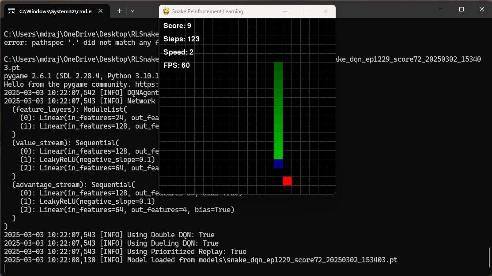

# Snake Reinforcement Learning

This project implements a reinforcement learning agent that learns to play the classic Snake game using Deep Q-Networks (DQN) with PyTorch. The agent uses several advanced RL techniques to enhance learning performance.



## Features

- Snake game environment with customizable grid size and game speed
- Deep Q-Network (DQN) implementation with several enhancements:
  - Double DQN to reduce overestimation bias
  - Dueling DQN architecture for better value estimation
  - Prioritized Experience Replay for efficient learning
- Visualization of training progress and agent performance
- Command-line interface for training and playing

## Installation

1. Clone the repository

   ```bash
   git clone https://github.com/rajuX75/Snake-Reinforcement-Learning.git
   cd Snake-Reinforcement-Learning
   ```

2. Create and activate a virtual environment (optional but recommended)

   ```bash
   python -m venv venv
   source venv/bin/activate  # On Windows, use: venv\Scripts\activate
   ```

3. Install the required packages
   ```bash
   pip install -r requirements.txt
   ```

## Requirements

- Python 3.7+
- PyTorch
- NumPy
- Pygame
- Matplotlib

## Usage

### Training a new agent

```bash
python main.py --mode train --episodes 1000 --render_freq 50
```

### Training with custom parameters

```bash
python main.py --mode train --episodes 2000 --fps 120 --speed 1 --save_freq 200
```

### Playing with a trained agent

```bash
python main.py --mode play --load models\snake_dqn_ep1229_score72_20250302_153403.pt
```

### Command-line Options

- `--mode`: `train` or `play` (default: `train`)
- `--episodes`: Number of episodes for training (default: 1000)
- `--load`: Path to pre-trained model to load
- `--render`: Enable rendering for all episodes
- `--render_freq`: Frequency of episodes to render during training (default: 20)
- `--save_freq`: Frequency of episodes to save model during training (default: 100)
- `--fps`: FPS for rendering (default: 60)
- `--speed`: Snake speed, lower is faster (default: 2)

## Project Structure

```
snake-rl/
├── main.py               # Main script with RL training and gameplay
├── config.py             # Configuration parameters
├── models/               # Saved model checkpoints
├── logs/                 # Training logs
└── plots/                # Performance visualizations
```

## Configuration

You can modify the learning parameters and game settings in `config.py`:

- Game parameters (grid size, speed, etc.)
- DQN hyperparameters (learning rate, discount factor, etc.)
- Reward structure
- Network architecture

## Training Process

1. The agent starts with a high exploration rate (epsilon) and gradually reduces it
2. It stores experiences in a replay memory and learns from batches of experiences
3. Training statistics are logged and visualized
4. Models are saved periodically and when new high scores are achieved

## Customization

### Modifying Rewards

You can modify the reward structure in `config.py` to encourage different behaviors:

```python
class RewardParams:
    REWARD_FOOD = 10.0
    REWARD_DEATH = -10.0
    REWARD_MOVE_TOWARDS_FOOD = 0.1
    # ... and more
```

### Changing Network Architecture

You can adjust the network architecture by modifying the DQN parameters:

```python
class DQNParams:
    HIDDEN_SIZE = 128
    NUM_LAYERS = 2
    # ... other parameters
```

## Performance Tips

1. For faster training:

   - Reduce grid size
   - Decrease snake speed
   - Increase learning rate
   - Run with rendering disabled except for occasional visualization

2. For better performance:
   - Increase memory size
   - Use all advanced techniques (Double DQN, Dueling DQN, Prioritized Replay)
   - Train for more episodes

## Visualization

Training statistics are plotted and saved in the `plots/` directory, including:

- Scores over time
- Average scores
- Training loss
- Exploration rate (epsilon)

## Contributing

Contributions are welcome! Please feel free to submit a Pull Request.

## License

This project is licensed under the MIT License - see the LICENSE file for details.

## Acknowledgements

- The DQN algorithm is based on the paper "Human-level control through deep reinforcement learning" by Mnih et al.
- Double DQN, Dueling DQN, and Prioritized Experience Replay are based on research by DeepMind.
